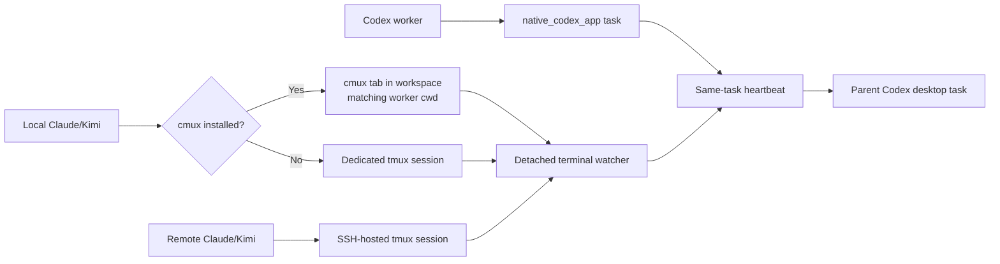

# Codex Desktop Mixed-Worker Orchestration

Date: 2026-07-22
Status: Proposed

## Summary

Use three explicit worker channels:



- Rename the app channel everywhere from `native_app` to `native_codex_app`; expose it on the CLI as `native-codex-app`.
- Keep the watcher detached. It must not live in tmux or a cmux tab; those surfaces are for workers and optional viewers.
- Prefer cmux for local Claude/Kimi workers whenever the binary is installed. Fall back to tmux only when cmux is not installed.
- Because Codex desktop currently cannot access cmux under `cmuxOnly` mode, configure authenticated password control as a one-time prerequisite.
- Keep Codex workers as native app tasks monitored through task status/history and the one-minute parent-task heartbeat.

## Local Terminal Placement

Add a cmux placement resolver that receives the worker's canonical working directory and returns an exact window and workspace UUID.

1. Resolve the requested cwd with `realpath`.
2. If `cmux` is absent from the environment built by `agents.env.build_env()`, launch a dedicated tmux session.
3. If cmux is installed, require authenticated `cmux ping` to succeed. An installed but inaccessible or broken cmux is a configuration error, not a reason to silently use tmux.
4. Enumerate windows and workspace metadata using structured cmux output.
5. Search every window for a workspace whose saved or launch cwd resolves to the requested cwd:
   - Prefer a match in the current cmux window.
   - Otherwise use the first matching workspace in stable window order.
6. If no matching workspace exists but a window is open, create a workspace with `--cwd <canonical-cwd>` in the current window.
7. If no cmux window exists, create one, then create the cwd-matched workspace in it.
8. Open the worker as a terminal surface using the exact window and workspace UUIDs, `--working-directory <canonical-cwd>`, and `--focus false`.
9. Rename only that new surface to the handoff task name and retain its exact UUID as the registered worker handle.
10. Never close, rename, reorder, or repurpose pre-existing windows, workspaces, or surfaces.

Snapshot windows and workspaces before every placement mutation and verify afterward that every pre-existing UUID remains. If inventory is ambiguous, structured metadata lacks a cwd, or a pre-existing object disappears, abort the launch and report the discrepancy.

## cmux Authentication Setup

Provide an explicit one-time setup helper for Codex desktop:

- Back up the existing cmux configuration to a timestamped file before editing it.
- Generate a high-entropy password without printing it.
- Set cmux automation to password control and store its matching password in the cmux configuration.
- Add or update `CMUX_SOCKET_PASSWORD` in `~/.config/secrets.env` without disturbing other entries; keep both files mode `0600`.
- Return only setup status and whether cmux must be reloaded or restarted.
- If the running cmux instance still enforces `cmuxOnly`, stop and instruct the user to reload configuration from an existing cmux terminal or restart cmux. Do not automate a disruptive application restart.
- All launcher, watcher, doorbell, and cleanup subprocesses must use `agents.env.build_env()` so the password is available under Codex desktop, launchd, and cron.
- Record the backup path, but never the password, when reporting this durable external configuration change.

## Worker and Watcher Channels

### `native_codex_app`

- Rename the watcher transport, validation branches, documentation, tests, and notification labels to `native_codex_app`.
- Use `native-codex-app` as the CLI spelling and `native_codex_app` in JSON state.
- Provide a one-time state migration for legacy `native_app` snapshots. Do not retain `native_app` as a normal user-facing choice.
- Bind this orchestrator to `CODEX_THREAD_ID` and a renewable five-minute lease rather than a turn-scoped process PID.
- A one-minute in-chat heartbeat renews the lease, loads terminal pending events, and checks registered Codex tasks with `wait_threads`.
- Use `native_codex_app_heartbeat` as the delivery-method label. A best-effort macOS notification may supplement it but is not semantic delivery.

### Terminal workers

- Local cmux or tmux and remote tmux workers continue to use local-v1 journals as authoritative state.
- One detached watcher on the Codex desktop host observes local runs and credential-free proxies for remote runs.
- For cmux workers, later doorbells address the registered workspace and surface UUID using password-authenticated cmux control.
- Remote Claude/Kimi workers always remain SSH-hosted tmux sessions. A local cmux tab may be added as a viewer, but it does not own the remote worker.
- SSH or cmux failures leave events pending and retryable.

### Codex workers

- Create explicitly requested background Codex workers as native app tasks against the exact saved project and host.
- Store `threadId`, `hostId`, wait cursor, environment, and observed state in a locked sibling roster.
- Keep task status/history authoritative; do not create local-v1 journals or tmux sessions for these workers.
- Limit one parent orchestrator to eight active native Codex tasks.
- Same-turn Codex subagents remain the app's built-in collaboration lane and are outside this handoff roster.
- Terminal Codex workers remain outside v1.

## Interfaces and Heartbeat

Expose:

```text
handoff_orchestrator_ensure.sh --transport native-codex-app
handoffctl orchestrator renew --state STATE
handoffctl orchestrator stop --state STATE

handoffctl orchestrator app-worker add|observe|remove|list ...
handoffctl orchestrator heartbeat attach|detach ...

handoffctl cmux setup-password-control
handoffctl cmux placement --cwd PATH [--dry-run]
```

The heartbeat workflow:

1. Restart or renew the detached terminal watcher.
2. Load terminal events with `orchestrator pending`.
3. Call `wait_threads` with `timeoutMs: 0` for registered Codex tasks.
4. Triage all actionable events together and persist app-task cursors only after handling them.
5. Perform only actions already authorized by the handoff request.
6. Pause after surfacing a question that requires user input.
7. Stop the watcher and disable the heartbeat when every worker is finished.

Launch-only requests create neither a heartbeat nor a managed watcher.

## Test Plan

- Verify legacy `native_app` state migrates to `native_codex_app`, while new CLI and JSON output use only the new name.
- Verify native-app lease renewal, expiry, restart, and heartbeat shutdown.
- Verify cmux-absent environments select tmux.
- Verify cmux-installed but unauthorized environments fail with password-setup guidance rather than using tmux.
- Verify an existing cwd-matched workspace is reused without creating a window or workspace.
- Verify an open window without a matching workspace receives one new cwd-matched workspace.
- Verify no-window state creates one window and one matching workspace.
- Verify multiple-window selection prefers the current window's match, then stable window order.
- Verify symlinked and normalized paths match by canonical cwd.
- Verify the new surface receives exact window/workspace UUIDs, explicit working directory, and no focus.
- Verify pre-existing cmux UUIDs survive every successful and failed placement.
- Verify passwords never appear in command output, logs, state, notifications, or tests.
- Verify local Claude/Kimi cmux workers, local tmux fallback workers, remote tmux workers, and native Codex tasks can be triaged in one heartbeat without duplicate handling.
- Verify app closure, SSH loss, cmux restart, and heartbeat duplication preserve durable worker events.
- Run focused launcher, watcher, registry, CLI, environment, and skill tests followed by the full pytest suite.

## Assumptions and Restrictions

- Password-authenticated cmux control is the selected approach.
- If cmux is installed, configuration or runtime failure is surfaced; tmux fallback occurs only when the binary is absent.
- Worker placement does not steal keyboard focus from the user.
- One writing worker per checkout is allowed; parallel writers require distinct worktrees or remote checkouts.
- The desktop app and computer must remain running for automatic heartbeat handling.
- Automatic model-visible notification latency is approximately one minute.
- Existing unrelated working-tree changes must be preserved.
- Direct app-server or `codex exec resume` injection remains deferred until safe desktop queueing is officially supported or independently proven.
